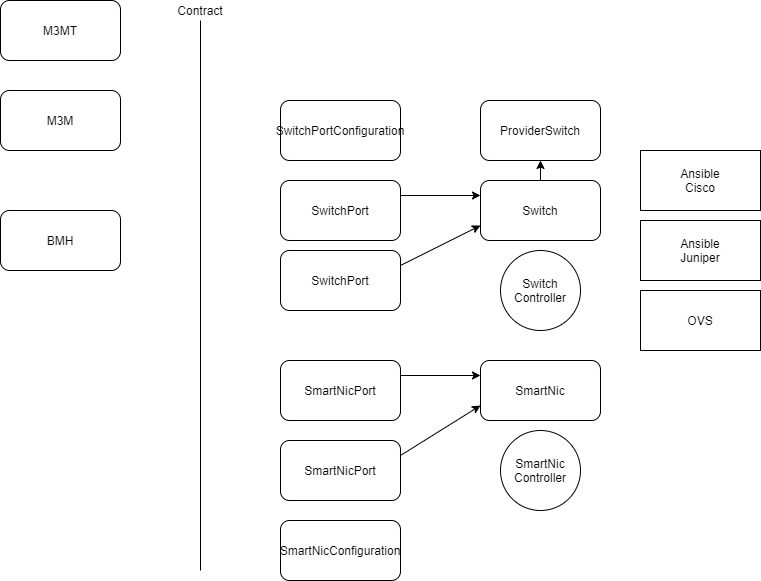
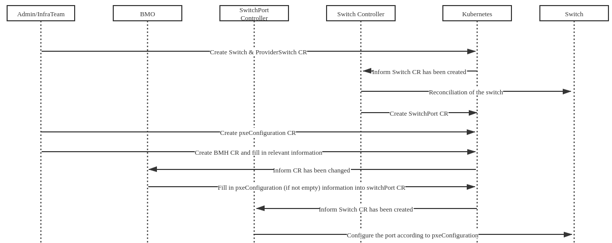
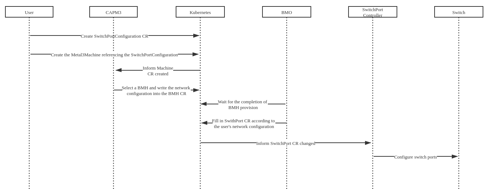
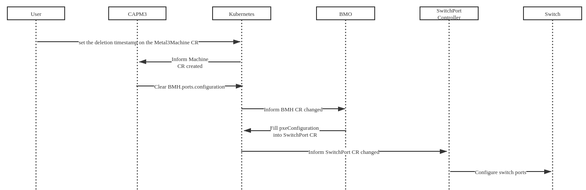
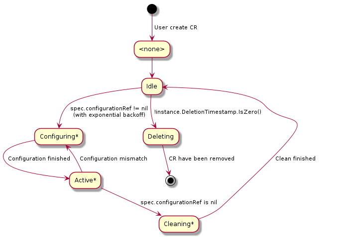

# Automatic network configuration

## Status

provisional

## Summary

This proposal is to expand the scope of Metal³ to include an API to
manage physical network devices.

## Motivation

Metal³ follows the paradigm of Kubernetes Native Infrastructure (KNI),
which is an approach to use Kubernetes to manage underlying infrastructure.
Managing the configuration of some physical network devices is closely
related to managing physical hosts. As bare metal hosts are provisioned
or later repurposed, there may be corresponding physical network changes
that must be made, such as reconfiguring a ToR switch port. If the provisioning
of the physical host is managed through a Kubernetes API, it would be
convenient to be able to reconfigure related network devices using a
similar API.

## Goals

- Define a Kubernetes API for configuring network device.
- Automatically configure the network infrastructure for a host when
  adding it to a cluster.
- Do network configuration when deprovisioning the hosts.
- Design a network abstraction that can represent any of the target networking
  configuration, independently of the controller used.

## Non-Goals

- Implement a network controller which is aimed at being an integration with
  an existing controller only.
- Implement a solution for a specific underlying infrastructure.
- Implement a solution for link aggregation in the future.
- Implement a solution for lldp in the future.

## Proposal

This document proposes to add a new mechanic to automatically perform physical
network device configuration before provisioning a BareMetalHost. First we
added the NetworkConfiguration operator to implement the network configuration
of the device. Then we added some methods to CAPM3 to implement together. When
network configuration is required, CAPM3 will process some content through
additional methods, and then trigger the NetworkConfiguration operator to
perform network configuration.

### User Stories

#### Story 1

As a consumer of Metal³, I hope that after adding the machine to the cluster,
the cluster can automatically put the machine into the corresponding network.

#### Story 2

As a consumer of Metal³, when a machine is deleted from the cluster, the
corresponding network configuration is automatically deleted.

#### Story 3

As a user/admin a SmartNIC that is hosted in a BMH needs to be provisioned,
pre-configured, and then capable of in operation management.

Physical server(OS) -----> SmartNIC(virtual switch(OVS) ---> physical NIC)
←-- (LAN cable)-----> PortID

#### Story 4

As a user, when creating a network configuration and specifying link
aggregation, the related BMH and switch can be automatically configured.

#### Story 5

As a user, when creating a network configuration, it is possible to configure ACL
settings in a switch for each bare metal server according to its functionality.
The ACL setting:

- Direction: ingress or egress
- Protocol: SSH, HTTP, …all
- Action: allow, deny
- Port status: up, down (status of the switch port)

## Design Details

### Structure

In the network operator, we abstract the following roles:

#### Device

Abstract all devices in the cluster (such as Switch, SmartNic).
Each type of network device must have its own CRD.

At the same time, each device has its own specific interface, and
needs to implement corresponding interfaces for different vendors
and device types. The following is an example of a switch interface:

```go
// Switch is a interface for different protocol
type Switch interface {
    // GetPortAttr get the port's configure
    GetPortAttr(ctx context.Context, name string)
        (configuration *v1alpha1.SwitchPortConfiguration, err error)

    // SetPortAttr set configure to the port
    SetPortAttr(ctx context.Context, name string,
        configuration *v1alpha1.SwitchPortConfiguration) (err error)

    // ResetPort remove all configure of the port
    ResetPort(ctx context.Context, name string,
        configuration *v1alpha1.SwitchPortConfiguration) (err error)
}
```

#### ProviderDevice

ProviderDevice represents different ways to connect to the device.
It contains all the information required to connect the device.

#### DevicePort

Indicates the specific port. Each type of Port must
have its own CRD.

#### Configuration

Indicates the content of the specific configuration of each port.
Each type of `Configuration` must have its own CRD.

#### Device Controller

Device Controller is optional, it is responsible for controlling the
power of Device and managing `Device Port`.

#### DevicePort Controller

Each `DevicePort` must have its own `DevicePort controller` to monitor
the corresponding `DevicePort`, and connect to `Device` to change the
configuration of the corresponding port according to the `DevicePort` change.
Each Port controller must implement the method of configuring `Device`
specified by the `ProviderDevice`.



### Workflow

The next image shows the workflow of the network operator itself,
not integrated with Metal3:

If integrated with Metal3, the workflow is:

#### Create CR related to BMH's network: Switch, ProviderSwitch

1. Administrator/Infra team creates the corresponding CRs(Switch and
  ProviderSwitch) according to the specific network infrastructure.
2. Reconciliation of the switch:
    1. Fetch the Provider switch, if not found, requeue until created.
    2. Credentials verification (inc. pulling current state).
3. Administrator/Infra team creates provisioningConfiguration (this is a specific
  implementation CR of  `SwitchPortConfiguration`, which is a
  private network used by the machine during provisioning).
4. Administrator/Infra team creates a `BareMetalHost` CR and fills in
  the content in `bmh.spec.ports` according to the actual
  network connection to refer to a switchPort.
5. BMO fill in the information in `bmh.spec.ports.provisioningConfiguration`
  (if not empty) into the corresponding `switchPort` CR.
6. SwitchPort Controller configures the switch port according to provisioningConfiguration.



#### Provisioning workflow

1. User creates the Metal3MachineTemplate referencing a SwitchPortConfig
  (optional).
2. User specifies the `spec.networkConfiguration` field.
3. User creates `SwitchPortConfiguration` for the deployment.
4. CAPI / user creates the Metal3Machine (based on the Metal3MachineTemplate),
  referencing the `SwitchPortConfiguration`.
5. CAPM3 filters the BMH by calling the `filter()` function. Then select a BMH
  according to the original method.
6. Before provisioning, if the machine's `networkConfiguration` field is not
  empty, CAPM3 will call the configureNetwork() method to fill
  networkConfiguration into the appropriate BMH spec.
    1. CAPM3 filters the interfaces of BMH based on the NicHint provided
    for the network configuration.
    2. CAPM3 identifies the port in the BMH spec that maps to the interface
    selected based on the NicHint.
    3. CAPM3 sets the `BMH.spec.ports.configuration` field.
7. BMO detects that the status.state of the Port CR corresponding to all BMH
  network cards is empty (without config in the specs) or Active, and then
  continues to provision BMH.Configure the network configuration set by the
  user after provision is completed.
7. BMO edit the SwitchPort.
    1. BMO fetches the SwitchPort object referred to in the BMH spec.
    2. BMO sets the SwitchPortConfig in the port specs, and applies it.
    3. BMO waits for the port to be configured.
8. The SwitchPort controller detects that SwitchPort.spec.configurationRef changed,
  then carry out the corresponding processing:
    1. Verify the user configuration to match the switch configuration
    (allowed vlans etc.) (Validating step).
    2. Credentials verification (Validating step).
    3. Apply the configuration to the port on the switch (Configuring step).
    4. Update the port CR (status) (Configuring step).
    5. Port is in Active step.



#### Update Workflow

1. The Switch controller detects that Port.spec.configurationRef changed, then
  carry out the corresponding processing:
    1. Verify the user configuration to match the switch configuration
    (allowed vlans etc.) (Validating step).
    2. Credentials verification (Validating step).
    3. Apply the configuration to the port on the switch (Configuring step).
    4. Update the port CR (status) (Configuring step).
    5. Port is in Active step.

#### Deprovisioning workflow

1. CAPI / User set the deletion timestamp on the `Metal3Machine` CR.
2. CAPM3 calls the `deconfigureNetwork()` to clears the contents of
  `BMH.ports.configuration`.
3. BMO deconfigures the ports.
    1. `BMH.ports.provisioningConfiguration` is empty
        1. BMO clears the configuration field in the switchPort CR
          corresponding to the network card.
        2. SwitchPort controller starts to deconfigure the network by calling
          `device.DeConfigurePort()`. Return the port to a `cleaning` state.
            1. Verify the switch credentials (Cleaning Step).
            2. Configure the port on the switch (Cleaning Step).
            3. If timeout reached, goes to error state.
            4. Update the switchPort CR.
            5. SwitchPort in Idle state.
    2. `BMH.ports.provisioningConfiguration` is not empty
        1. BMO fills the contents of `BMH.ports.provisioningConfiguration` into the
          corresponding SwitchPort CR.
        2. SwitchPort controller starts to configure the network.
          Return the port to a `configuring` state.
5. BMO detects that the status.state of the Port CR corresponding to all BMH
  network cards are idle or active, and then continues to deprovision BMH.
  If any of the ports are in error state -> goes to error state.



#### Deletion workflow

1. User sets deletion timestamp on all resources (that automatically triggers
  the deletion of the Provider Switch because of OwnerRefs).
2. Switch deletion is blocked until all SwitchPorts are deleted.
3. Wait for switch port to be idle.
4. If switchPort is idle, then remove the finalizer.
5. Once no ports are left for the Switch, then remove the finalizer on
  the ProviderSwitch and on the Switch.

### Changes to Current API

#### Metal3Machine CRD

```yaml
spec:
  # Specify the network configuration that metal3Machine needs to use
  networkConfiguration:
  # no smartNic
  - ConfigurationRef:
    name: nc1
    kind: SwitchPortConfiguration
    namespace: default
    # Network card performance required for this network configuration
    nicHint:
      name: eth0
      smartNIC: false
  # with smartNic
  - ConfigurationRef:
    name: nc1
    kind: SmartNicConfiguration
    namespace: default
    nicHint:
      name: eth1
      smartNIC: true
```

#### BareMetalHost

Add the `ports` field to `.spec` to indicate the connection information and
performance of all network cards in the `BareMetalHost`. The name field is
provided for direct matching with `Metal3Machine` network configuration,
in case the hardware details are not provided, and the mac address is
provided to match the introspection data, when nicHints are provided
and the name is not.

```yaml
  spec:
    ports:
    - mac: 00:00:00:00:00:00
      name: eth0
      port:
        name: port0
        kind: SwitchPort
        namespace: default
      provisioningConfiguration:
        name: provisioningSwitchPortConfiguration
        kind: SwitchportConfiguration
        namespace: default
      configuration:
        name: switchPortConfiguration
        kind: SwitchportConfiguration
        namespace: default
```

### Add new CRD and controller

#### Switch

The following is the realization of the switch:

##### ProviderSwitch CRD

ProviderSwitch CRDs include the login information of switches for different
protocols. For each ProviderSwitch CRD, there will be a provider
implementation knowing how to interact with the switch with this information.

###### AnsibleSwitch CRD

Use ansible as the backend to connect to the configuration switch
(using the network-runner tool, currently only supports the switches supported
by network-runner).

```yaml
apiVersion: v1alpha1
kind: AnsibleSwitch
metaData:
  name: sp0
  namespace: default
spec:
  # The type of OS this switch runs
  os: fos
  # The ip address of the switch
  ip: 192.168.0.1
  # The port to use for SSH connection
  port: 22
  # Only for ovs switch
  bridge:
  # The login credentials of switch
  secret:
    name: switch-example-secret
    namespace: default
```

##### Switch CRD

```yaml
apiVersion: metal3.io/v1alpha1
kind: Switch
metadata:
  name: switch-example
spec:
  provider:
    kind: AnsibleSwitch
    name: ansibleswitch-sample
  ports:
    "switchport-example":
      # The port name in the switch
      name: <port-name>
      # True if this port is not available, false otherwise
      disabled: false
      # Indicates the range of VLANs allowed by this port in the switch
      vlanRange: 1, 6-10
      # True if this port can be used as a trunk port, false otherwise
      trunkDisable: false
```

##### SwitchPort CRD

```yaml
apiVersion: metal3.io/v1alpha1
kind: SwitchPort
metadata:
  name: switchport-example
  ownerReferences:
    - apiVersion: metal3.io/v1alpha1
      kind: Switch
      name: switch-example
      uid: <switch-uuid>
spec:
  configuration:
    name: switchportconfiguration-example
```

##### SwitchPortConfiguration CRD

```yaml
apiVersion: metal3.io/v1alpha1
kind: SwitchPortConfiguration
metadata:
  name: switchportconfiguration-example
spec:
  # Represents the ACL rules implemented in the switch.
  acl:
  - type: # ipv4, ipv6
    action: # allow, deny
    protocol: # TCP, UDP, ICMP, ALL
    src: # xxx.xxx.xxx.xxx/xx
    srcPortRange: # 22, 22-30
    des: # xxx.xxx.xxx.xxx/xx
    desPortRange: # 22, 22-30
  untaggedVLAN: 1
  # Indicates which VLAN this port should be placed in.
  vlans:
  - id: 2
    name: vlan-2
  - id: 3
    name: vlan-3
  disabled: false
```

##### SwitchPort Controller

###### State machine for SwitchPort controller

SwitchPort controller sets 6 states for Port.status.state:
None, Idle, Configuring, Active, Cleaning and Deleting,
each state has its own corresponding function.

- \<None>
    1. Indicates the status of the Port CR when it was first created,
    and the value of `status.state` is nil.
    2. The state handler will add finalizers to the Port CR to avoid being
    deleted, and set the state of CR to `Idle`.
- Idle - Steady state
    1. Indicates waiting for spec.configurationRef to be assigned.
    2. The state handler check spec.configurationRef's value,
    if isn't nil set the state of CR to Configuring
    3. If deletionTimestamp set, goes to `Deleting`.
- Configuring
    1. Indicates that the port is being configured.
    2. The state handler configures the port's network and checks configuration
    progress. If finished set the state of CR to `Active` state.
- Active - Steady State
    1. Indicates that the port configuration is complete.
    2. The state handler check whether the target configuration is consistent
    with the actual configuration, return to `Configuring` state and clean
    `status.configurationRef` when inconsistent.
    3. If deletionTimestamp is set -> go to `Cleaning`
- Cleaning
    1. Indicates that the port configuration is being cleared.
    2. The state handler deconfigure port's network and check deconfiguration
    progress, when finished clean `spec.configurationRef` and
    `status.configurationRef` then set CR's state to `Idle` state.
    3. If deletionTimestamp set, goes to Deleting.
- Deleting Reached when in Idle state + deletionTimestamp set
    1. Indicates that the port configuration has been cleared.
    2. Prepares for deletion.
    3. The state handler will remove finalizers.



#### SmartNIC

##### SmartNICPort CRD

```yaml
apiVersion: v1alpha1
kind: SmartNicPort
metaData:
  name: port2
  ownerRef:
    name: smart1
  finalizers:
  - defaulf-bm0
spec:
  configurationRef:
    name: sn1
    namespace: default
  # Represents the next port information of this port link
  nextPortRef:
    name: port3
    kind: SwitchPort
    namespace: default
status:
  # Indicates the actual configuration status of the port
  state: Configured
  # Indicates the configuration information currently applied to the port
  configurationRef:
    name: sn1
    namespace: default
```

##### SmartNicConfiguration CRD

```yaml
apiVersion: v1alpha1
kind: SmartNicConfiguration
metaData:
  name: sc1
  namespace: default
  finalizers:
    - default-port0
spec:
  ...
  nextConfigurationRef:
  name: sp1
  kind: SwitchPortConfiguration
  namespace: default
```

### Multi-tenancy models

- No multi-tenancy : one set of controllers deployed, all objects are
  reconciled by the same controllers.
- "Limited" multi-tenancy : one set of CRs (the most up-to-date), one set of
  webhooks and a single network controller with clusterRole and in its own
  namespace. All other controllers (CAPI + CAPM3) per namespace. Permission
  separation between namespaces.
- Full multi-tenancy : one set of CRs (the most up-to-date), one set of
  webhooks. All other controllers per namespace. No permission separation
  within the same namespace.

### Permissions

The permissions for a role include the permissions given to the controllers
deployed by that role.

#### Scenario: One cluster operator

Description: Only one cluster operator has full management access to all resources

Multi-tenancy models:

- None

Roles:

- Operator: Full control
  Scope: Cluster

Operations Allowed:
||Operation / resource|Goal|
|:-|:-|:-|
|Operator|All/All|Configure everything|

Operations Not Allowed:
||Operation|Goal|
|:-|:-|:-|
|Operator|None||

#### Scenario: Many cluster operators

Description: Each operator has full management access to all resources in his namespace.

Multi-tenancy models:

- Full

Roles:

- Operator: Full control
  Scope: Cluster

Operations Allowed:
||Operation / resource|Goal|
|:-|:-|:-|
|Operator|All/All|Configure everything|

Operations Not Allowed:
||Operation|Goal|
|:-|:-|:-|
|Operator|None||

#### Scenario: Infra team and consumers

Description: There is an owner of the infra and some consumers. The infra
team is the owner of the management cluster and manages the physical resources.
A consumer is the manager of the target cluster, responsible for its lifecycle.
The consumer gets resources from the infra team (tenant). No consumer action
should impact another consumer. Metal3 setup on a shared management cluster,
with namespaces for each consumer.

The switch is shared between multiple consumers (dedicated ports, vlans etc.)
and managed by the infra team.

Multi-tenancy models:

- Limited

Roles:

- User: Configuration of existing ports
  Scope: Namespaced
- Operator: Definition of the infra
  Scope: Namespaced

Operations Allowed:
||Operation/resource|Goal|
|:-|:-|:-|
|User|Create-delete-Update/SwitchPortConfiguration|Create any configuration|
|User|Modify the SwitchPort|Link a configuration|
|Operator|All/All||

Operations Not Allowed:
||Operation/resource|Goal|
|:-|:-|:-|
|User|Create-Delete/SwitchPort|Modify the infra objects|
|User|All/Switch|Modify the infra objects|
|Operator|None||

### Implementation Details/Notes/Constraints

#### Re-applying the configuration (no configuration change in K8S)

Pros:

- Declarative approach, keep in sync the K8S object and the switch
  configuration.
- React on errors / misconfigurations etc.
- Trap configuration changes between reconciliation.

Cons:

- Configurability might be missing some coverage, operator manually changes it.
  Some exceptions might be reasonable (e.g. credentials change)
- Might be heavy process (can be fixed by reducing the frequency,
  jittering etc.)
- Other actors might increase complexity.
- No full ownership guaranteed of the hardware
- Could break during an upgrade

Possibility to add a boolean in the CR to control whether we reconcile and
re-apply the configuration if there is a delta, or not.

#### Immutable approach

- SwitchPortConfiguration object immutable.
- Changes would be done by new configuration and linking the new configuration
  in the ports.
- Reconciliation triggered for each port.
- Any changes on the physical switch is ignored until a new SwitchConfiguration
  is linked.
- Required to keep the CAPI model support. New configuration should not impact
  old machine running.

#### Clean port definition

Defined by infra team, which ports are for PXE/iPXE boot, which are not.

Two cleaning configuration:

1. PXE/iPXE boot (allows IPA booting).
2. Deconfigured (turning port off would disable LLDP messages for example,
   preventing IPA from gathering this info).
    1. Clean all vlan settings will be enough, acl etc.
    2. Port is still up.
    3. LLDP enabled.
    4. Other protocols? (STP for example)

#### IPA temporary config

- New `provisioningConfiguration` field in the `bmh.spec.ports.provisioningConfiguration`
  with reference to a switchportConfig (more flexible option). If not provided,
  the port goes to default configuration.
- Another option is to have the provisioningConfiguration defined once for the switch,
  with a boolean on each port to indicate if it needs the PXE config.

### Risks and Mitigations

- Breaking cluster during upgrade by adding empty switchPorts.

### Work Items

- Implement networkConfiguration operator.
- Change the API of Metal3Machine and BareMetalHost.
- Add related methods to CAPM3.
- Unit tests.

### Dependencies

- Ansible for some switch providers. Ansible collections for each switch OS.
- Go libraries for other protocols
- Kube-builder.

### Test Plan

#### Unit tests

- Mocks support (internal interfaces and external, physical devices mocking)
- Create a “fixture” switchProvider.
- Create a go mock for the provider interface.
- K8S fake client

#### Integration tests

ProviderSwitch needs extensive testing (ansible playbooks with
[Molecule](https://molecule.readthedocs.io/en/latest/examples.html) for exampl).
[fake-switches](https://github.com/internap/fake-switches) could be used to
mock hardware.

#### E2E tests

- metal3-dev-env with OVS/linux bridge.
- Integrate the tests in the integration test suite in Jenkins.

### Upgrade/downgrade strategy

Upgrade would be supported directly as the changes are API additions.
If not defined, the behaviour of upgraded BMO or CAPM3 does not change.
This provides some compatibility for objects deployed without the networking
support. Backwards compatible (BMH ports not provided).

To start using the network configuration tools, the user will need to create
the switchPort with a SwitchPortConfiguration already associated, otherwise
the port on the switch would be deconfigured. It could also work by creating
the objects during a rolling upgrade of BMHs.

To stop using those tools, this could be achieved during a rolling upgrade.

We will not support downgrade for now.

## Drawbacks

NONE

## Alternatives

NONE

## References

- [Issue](https://github.com/metal3-io/baremetal-operator/issues/570)
- [Physical-network-api-prototype](https://github.com/metal3-io/metal3-docs/blob/master/design/physical-network-api-prototype.md)
- [Contracts](https://github.com/Hellcatlk/network-operator/tree/master/docs)
- [POC](https://github.com/Hellcatlk/network-operator)
